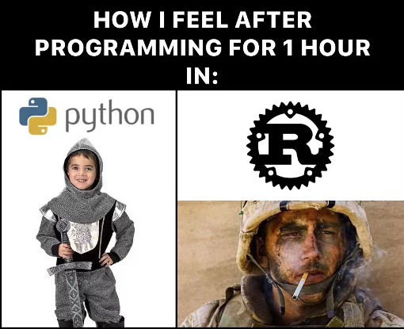

# Velkommen til Rust-workshop!
 ― Workshop for å lære programmeringsspråket Rust gjennom sjakk ―

    <strong>Er du klar for Rust-workshop? Hopp til intro-siden!</strong>
 
    [Intro →](./doc/intro.md)

___

# Om workshopen
Bli fortrolig med programmeringsspråket Rust gjennom å implementere sjakk!
https://2024.javazone.no/program/b5cc6d47-d9d7-4bf1-a229-9fbcb796d1e3

I kurset starter du med et tomt sjakkbrett, og ender opp (om du er rask, eller flittig til å bruke hint) med et fullverdig sjakkspill. Underveis blir du eksponert for syntaks og datastrukturer i Rust, blir kjent med Rust-tankegangen og lånesjekkeren, og ikke minst Cargo, vårt essensielle Rust-verktøy.

* Må jeg kunne Rust-ekspert? Nei, men du blir det (i alle fall litt)
* Må jeg være sjakk-entusiast? Nei, men kanskje du blir det?
* Må jeg skrive effektiv kode? Nei, men du får det likevel

# Om oss

    
    

* Isak er siving i Nanoteknologi og Entreprenørskap fra NTNU, og engasjert mannskorsanger. Han er fagleder i SpareBank 1 Utvikling, og trives både fremst og bakerst i teknologistakken, med henholdsvis React/TypeScript og Kotlin/Spring Boot. Han er dessuten svært språkinteressert, og har utviklet Fagord.no for å gjøre norsk fagspråk mer tilgjengelig.
* Geir Olav har i et tidligere JavaZone-foredrag blitt omtalt som «fullstack-ninja». Han har studert informatikk ved UiO – men rakk også to år med japansk, og lager for tiden et verktøy i Rust for å lære seg koreansk – som gjør ham allsidig i verdensspråk så vel som programmeringsspråk.  I SpareBank 1 Utvikling er han fullstack-utvikler i Bli kunde-teamet, og engasjert leder i Rust-faggruppen.

# Bakgrunn for workshopen
Opplegget er i hovedsak utviklet i forbindelse med _fagdagen_ hos [SpareBank 1 Utvikling](https://sparebank1.dev/). En fagdag er en hel dag satt av til faglig utvikling – og hos SpareBank 1 Utvikling er det fagdag hver torsdag.

Opplegget ble holdt først gang for resten av utviklerne i SpareBank 1 Utvikling i juni 2023.

# Tidsplan
| Klokkeslett | Aktivitet                      |
|-------------|--------------------------------|
| 09.00       | Motivasjon                     |
| 09.10       | Teori                          |
| 09.30       | Tavle-koding av oppgave 0 og 1 |
| 09.50       | Praktisk arbeid                |
| 10.50       | Oppsummering halvveis          |
| 11.00       | Lunsjpause                     |
| 11.20       | Selvstendig arbeid             |
| 12.45       | Oppsummering                   |

