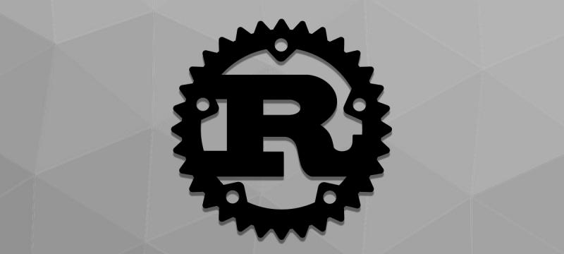

# Velkommen til Rust-workshop!
 ― Workshop for å lære programmeringsspråket Rust gjennom sjakk ―

### Er du fersk i Rust-gamet? Hopp til [Intro-siden](./INTRO.md)!



# Kom i gang
[Rust-boka](https://doc.rust-lang.org/book/) vil være en av dine beste venner i løpet av dette kurset. Start med å kjøre
installasjonskommandoen den foreslår:
```bash
curl --proto '=https' --tlsv1.3 https://sh.rustup.rs -sSf | sh
```

## Rust plugin i IntelliJ
Dersom du bruker IntelliJ anbefales det sterkt å installere Rust plugingen, og konfigure den slik:


Det kan også være kjekt å ha tilgang til avlusing (eng. *debugging*) om du jobber i IntelliJ. Kjør i så fall
```bash
sudo dnf install llvm-toolset
```
og last ned utvidelsen *Native Debugging Support* fra IntelliJ-markedsplassen.

## Kjøre programmet
`cargo run` vil først prøve å kjøre alle testene, og vil deretter kjøre `main`-metoden i en av `task_0`, `task_1`,
`task_2` osv. eller `finished_game` basert på hvilke tester som feiler.
 * Dersom en av testene i `task_0` feiler vil
`task_0`-koden kjøre.
 * Etter alle testene i `task_0` kjører grønt, vil `task_1` koden kjøre.
 * Hvis du vil kjøre koden fra task_0 igjen kan du gjøre det med `cargo run 0`.

### Kjør programmet i konteksten av en bestemt oppgave
Du kan også kjøre spillet med den koden du har implementert i en bestemt oppgave, med å spesifisere oppgavenummeret når
du kjører _cargo_. Dette gjør du slik:

 * `cargo run 0`
 * `cargo run 1`
 * `cargo run 2`
 * ...
 * `cargo run finished`