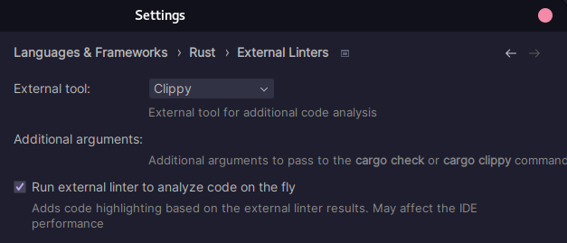

# Installer Rust

<span style="justify-content: space-between; display: flex"><span>
[← Workshop](./workshop.md)
</span> <span>
[Oppgave 0 →](../src/task_0/oppgave.md)
</span></span>

___

# Kom i gang
Den offisielt anbefalte installasjonsmetoden på macOS og Linux er via rustup scriptet. Du kan kjøre det slik:
```bash
curl --proto '=https' --tlsv1.2 https://sh.rustup.rs -sSf | sh
```

For Windows, følg instruksjonene under [`Installing rustup on Windows` her](https://doc.rust-lang.org/book/ch01-01-installation.html#installing-rustup-on-windows).

## Rust plugin i VS Code

Installer utvidelsen `rust-analyzer` i VS Code for å få støtte for Rust programmering.
For at debugging med breakpoints skal fungere kan du i tillegg installere utvidelsen CodeLLDB.

## Rust plugin i IntelliJ
Dersom du bruker IntelliJ anbefales det sterkt å installere Rust-utvidelsen, og konfigure den slik:



## Copilot / kodeassistenter
Vi tror mye av gleden med workshopen forsvinner ved å bruke Copilot eller liknende verktøy. Dessuten er det høyst trolig at du ville fått kodeforslag som ikke lærte deg særlig mye. Vi oppfordrer derfor til ikke å bruke slike kodeverktøy.

Men! Vi oppfordrer deg derimot på det sterkeste om å bruke hint! Vi har laget dem av en grunn 😉

