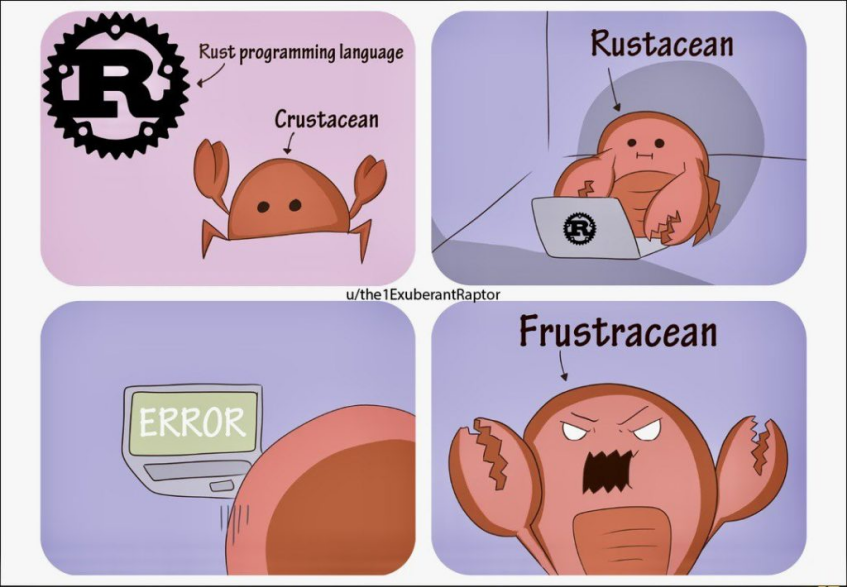

# Introduksjon

    [← README](../README.md)
 
    [Teorioversikt →](./teori.md)

___

## Hvorfor er så mange interesserte i Rust?

Rust har i åtte år på rad blitt kåret til det høyest elskede programmeringsspråket blant brukerne på Stack Overflow.
I 2022 var det 87 % av Rust-utviklere som sa at de ville fortsette å bruke språket.

Les gjerne:

* [Why the developers who use Rust love it so much](https://stackoverflow.blog/2020/06/05/why-the-developers-who-use-rust-love-it-so-much/)
* [7 Reasons to Use Rust for Your Next Development Project](https://geekflare.com/reasons-to-use-rust/)

## Hva er greia med Rust?

Rust er et multi-paradigmespråk, spesielt egnet for oppgaver som krever høy ytelse, pålitelighet og parallellitet. Det
kompilerer til binærkode, og brukes kanskje i størst grad for systemutvikling, det en ofte kan bruke C og C++ til. Rust
kan også kompilere til [WebAssembly](https://webassembly.org/), som gjør det mulig å dra nytte av den høye ytelsen også
i webapplikasjoner.

Rust er spesielt kjent for:

* **Minnesikkerhet**: Rust sikrer minnesikkerhet ved kompileringstid. Det gjør den ved å bruke en variabels _scope_.

> Bruker Rust _garbage collector_?
>
> Nei! Rust bruker ikke en garbage collector. I stedet frigjør Rust minnet tilknyttet en variabel når variabelen går ut
> av sitt scope. Dette gjør at Rust kan avgjøre ved kompileringstid når minnet kan frigjøres. Dette er i motsetning til
> språk som bruker en garbage collector (Java, Python, C#, Ruby), hvor garbage collectoren kjører som en parallell
> prosess for å finne og frigjøre minne som ikke lenger er referert av noen variabler. Ofte må hovedprosessen pauses
> mens dette pågår, noe som kan føre til "stuttering" og redusert ytelse.
>
> Ved å unngå bruk av en garbage collector oppnår Rust like god ytelse som C med hensyn til minnehåndtering. Samtidig
> unngår Rust potensielle problemer som minnelekkasjer og nullpekerfeil. Rust tilbyr også enkel dynamisk allokering av
> minne på en lignende måte som Kotlin, men uten at dette går på bekostning av ytelsen til en garbage collector.

* **Tråd-sikkerhet**: På grunn av hvordan Rust håndterer referanser til minne (gjennom konseptene _låning_ og
  _flytting_,
  som håndheves av _lånesystemet_ (eng. _borrow checker_) og variablers levetid, er Rust garantert å være tråd-sikkert.

* **Cargo**: Litt som _npm_ + _ESlint_ + _prettier_ + _Jest_. Tar seg av å kompilere koden, installere pakker, håndtere
  avhengigheter,
  lintsjekke koden din, kjøre tester. _Batterier inkludert_, med andre ord.

* **En hyggelig kompilator**: Rust-kompilatoren er spesielt velskreven, og kan ofte fortelle deg nøyaktig hvor i koden
  noe er feil, og kan foreslå hva du bør gjøre i stedet. (Cargo!)

> Kompileringssteget i Rust kan ofte oppfattes strengt, men gjennom å tvinge deg til å eksplisitt håndtere alt som kan
> feile, og å luke ut flere klasser av feil i kompileringssteget, gjør
> det at tiden til _debugging_ kuttes drastisk ned. Feilmeldingene fra kompilatoren gjør dette til en hyggelig oppgave.

## Hva kan Rust brukes til?

Som med alle språk er det fort gjort å bli så begeistret for Rust at en vil bruke det overalt. Som Maslow sa, «Den som
har en hammer, ser spiker overalt».

Rust ble opprinnelig utviklet for å være et moderne, minnesikkert alternativ til C og C++. Det er et «generelt»
programmeringsspråk som kompileres, og kan derfor i prinsippet brukes til alle formål. Rust er imidlertid spesielt egnet
for oppgaver som krever høy ytelse, pålitelighet og parallellitet.

I de siste årene har vi sett mange tilfeller av «Rewrite it in Rust», hvor mange prosjekter/kildekodebaser har blitt
skrevet om/skrevet på nytt i Rust, for eksempel:

* SWC, en JavaScript-kompilator og -bundler (alternativ til Babel og Webpack)
* Deno (Node omskrevet i Rust)
* Oxlint (alternativ til ESLint)
* Rolldown (alternativ til Rollup, under utvikling av Vite-gjengen)
* Drivere i Linux-kjernen

Les gjerne:
* [What is Rust commonly used for](https://github.blog/2023-08-30-why-rust-is-the-most-admired-language-among-developers/#what-is-rust-commonly-used-for)
* [Performance Doesn't Matter...Until It Does.](https://www.youtube.com/watch?v=2Z4fZtSKlcE)

### WebAssembly
Vektleggingen av ytelse og minnesikkerhet, og det er et kompilert språk, gjør Rust til en svært god kandidat for å 
for WebAssembly. WebAssembly er et maskinkode som kan kjøres i nettleseren, og Rust som WebAssembly gir oss dermed muligheten til å skrive kode som kjører i nettleseren med samme ytelse som
maskinkode. Figma er kanskje det beste eksemplet på programvare som kjører i nettleseren hvor WebAssembly er brukt 
for å oppnå høy ytelse.

Les gjerne:
* [Why Rust and WebAssembly?](https://rustwasm.github.io/book/why-rust-and-webassembly.html)

### Webutvikling

Rust er ikke først og fremst utviklet for å skrive webapplikasjoner, selv om dette er fullt mulig gjennom verktøy 
som *Arctix Web* og *Axum*. Vår erfaring er at Rust-API-er, som så mye annet i Rust, at det er mer krevende å skrive 
koden, men at produktet blir knallraskt.

Les gjerne:

* [Rust is a hard way to make a web API](https://macwright.com/2021/01/15/rust.html)
* [Are we web yet? Yes! And it's freaking fast!](https://www.arewewebyet.org/)

## Hva med Rust i SB1U?

Selv om vi blir et stort antall utviklere i SpareBank1 Utvikling som er glade i Rust og har lyst til å bruke det, er 
det kostnader knyttet til

* å utvikle verktøy og rammeverk rundt kode i Rust som vi allerede har i andre språk
* økosystemet rundt Rust er enda ikke så stort som rundt Java/Kotlin (eller JavaScript/TypeScript, forsåvidt), som gjør
  det vanskeligere å få støtte og å rekruttere kompetanse

Gevinsten i Rust er dessuten vanskeligere å innhøste når vi har mange avhengigheter til eksterne tjenester og partnere
som har høyere responstid og lavere ytelse enn oss. Da er det andre flaskehalser som begrenser vår ytelse.

Likevel kan det være bruksområder hvor Rust er nyttig ― spesielt der ytelse er essensielt. Dette kan være i
kommandolinjeverktøy, byggeverktøy, og særlig om vi finner bruksområder for WebAssembly i teknologistakken vår.

