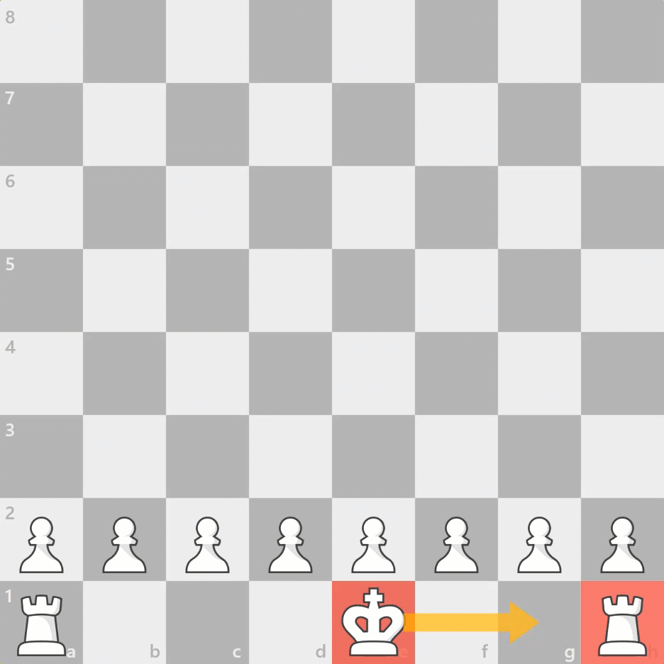

# Oppgave 13
> **Mål:** Finne mulige rokadetrekk

> **Hvor skal jeg jobbe:** [board.rs](board.rs)

I denne oppgaven skal du avgjøre om kongen har mulighet til å utføre rokade (eng. _castling_). Du skal ikke 
implementere selve trekket, bare kunne vise om rokade er et tilgjengelig trekk.

I tråd med FIDEs regler er dette å regne som kongens trekk, selv om både kongen og tårnet flytter seg i trekket. 



I rokade beveger kongen seg to felter i retning av tårnet, og tårnet flytter seg til feltet nærmest kongen på 
motsatt side. Det er derimot en rekke regler som avgjør om man kan gjøre rokade:
- En spiller kan ikke rokere med en konge eller et tårn som har vært flyttet tidligere.
- Kongen kan ikke stå i sjakk
- Feltene kongen skal flytte over kan ikke være truet av motstanderen
- Alle feltene mellom kongen og tårnet må være tomme

Les mer om [rokade](https://snl.no/rokade_-_sjakk).

## Kjøring
```bash
cargo run 13
```
```bash
cargo test task_13
```


Du finner også hint i [hint.md](hint.md).