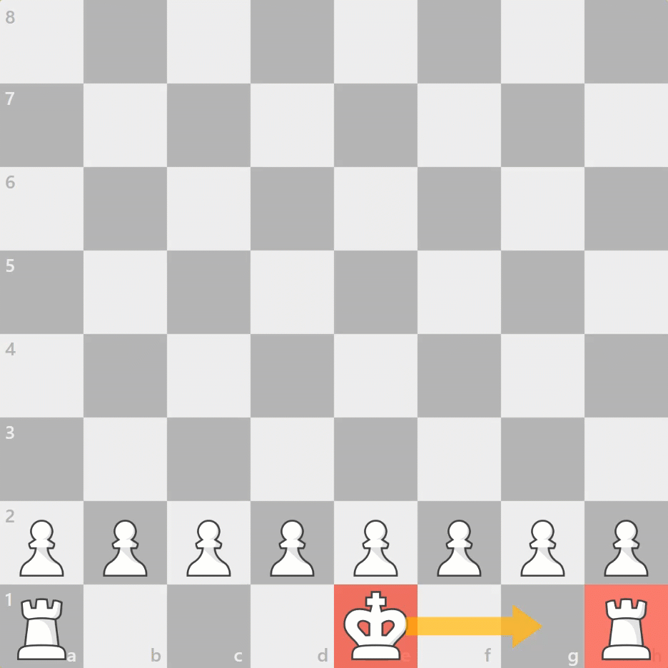

# Oppgave 14
> **Mål:** Utføre rokade

> **Hvor skal jeg jobbe:** [board.rs](board.rs)

I denne oppgaven skal du implementere rokade-trekket, etter at vi i oppgave 13 klarte å finne når rokade var mulig.



Les mer om [rokade](https://snl.no/rokade_-_sjakk).

## Kjøring
```bash
cargo run 14
```
```bash
cargo test task_14
```


Du finner også hint i [hint.md](hint.md).