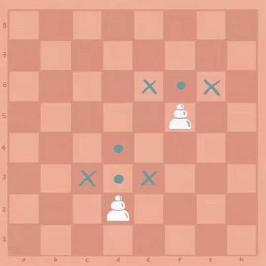

# Oppgave 2
> **Mål:** Implementere vanlig bevegelse for _hvit bonde_

> **Hvor skal jeg jobbe:** [piece/pawn.rs](piece/pawn.rs)

I denne oppgaven fortsetter vi på forrige oppgave, og skal utvide `Pawn::get_moves()` til å gi oss åpningstrekk _og_
vanlige trekk for hvite bonden. Vi bør også ta hensyn til at en annen brikke kan stå i veien for bondens steg 
fremover. Du kan fortsatt se bort i fra:
- svarte bønder
- trekk for å angripe

I denne filen finner du en forklaring på hvordan bonden kan bevege seg, og en oppgavebeskrivelse. I koden
vil det finnes kommentarer som beskriver hva ulike metoder gjør, og det står `todo!()` i metoden du skal implementere.

Du finner også hint i [hint.md](./hint.md).

## Bondens trekk
Bonden er den mest grunnleggende brikken i sjakk, men dens bevegelsesmønster kan være litt forvirrende til å begynne 
med. Vi kommer til å fokusere på tre typer bondetrekk:
- Åpningstrekk: Bonden kan bevege seg ett eller to felt fremover
- Generell bevegelse: Bonden kan bevege seg ett felt fremover
- Angrepstrekk: Bonden kan slå brikker som befinner seg diagonalt foran bonden.

Bonden kan altså ikke gå til siden eller bakover, og den kan kun slå diagonalt. Se figuren under:



> **Merk!** I denne oppgaven skal vi kun implementere vanlig bevegelse for den hvite bonden.

## Oppgavebeskrivelse

Utvid `Pawn::get_moves()` til å returnere gyldige trekk for bonden (se bort i fra angrepstrekk) uansett hvor bonden 
befinner seg, og også om det er brikker i veien. Du kan se bort i fra nederste rad (der den hvite bonden aldri befinner 
seg).

Oppgaven er fullført når testene kjører grønt.

## Kjøring
```bash
cargo run 2
```
```bash
cargo test task_2
```

## Les mer om:
   - [Metoder som muterer](https://doc.rust-lang.org/book/ch05-03-method-syntax.html?#defining-methods)
   - [HashSet](https://doc.rust-lang.org/std/collections/struct.HashSet.html)
   - [Referanser](https://doc.rust-lang.org/book/ch04-02-references-and-borrowing.html)

Se [hint.md](hint.md) for hint.