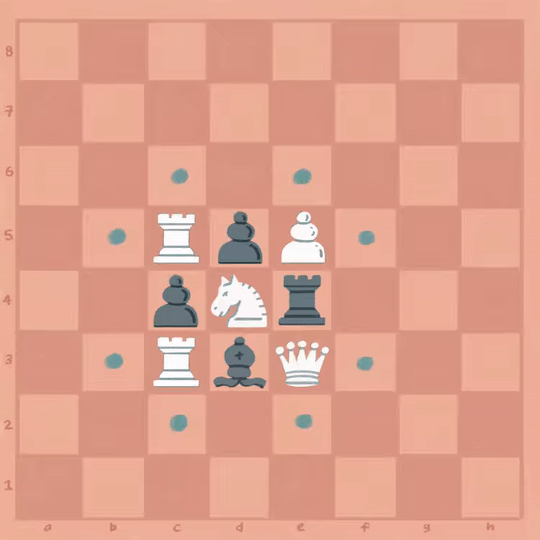

# Oppgave 3
> Mål: Implementere springerens trekk

> Hvor skal jeg jobbe: [piece/knight.rs](piece/knight.rs)

I denne oppgaven skal vi implementere trekkene til springeren (hest). Dette gjøres ved å implementere metodene som 
er definert i `impl Piece for Knight {}`-blokken. Se etter metoden som inneholder en `todo!()`. I koden finner du 
også kommentarer som forklarer hva ulike metoder gjør.


Du finner også hint i [hint.md](hint.md).

## Springerens trekk
Springeren beveger seg i noe man kan kalle et `L`-mønster:
- Hvert trekk forflytter springeren to steg i én retning og ett steg i rett vinkel fra den
  første retningen
- Springeren kan kun gå til felter som er tomme, eller der en brikke av motsatt farge står




## Eksempel
Hvit springer i startposisjon `b1` skal kunne gå til `a3` og `c3`:

```rust
let knight = Knight::new(Color::White, "b1".as_u8().unwrap());
let legal_moves = set!["a3", "c3"];
assert_eq_set!(legal_moves, pawn.get_moves(&empty_set!(), &empty_set!());
```

Se [hint.md](hint.md) for hint.