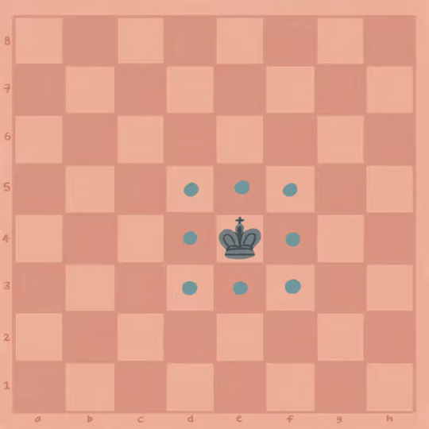

# Oppgave 6
> **Mål:** Implementere kongens trekk

> **Hvor skal jeg jobbe:** [piece/king.rs](piece/king.rs)

I denne oppgaven skal vi implementere trekkene til kongen. Du finner metodene som skal implementeres
`impl Piece for King {}`-blokken. Se etter metoden som inneholder en `todo!()`. I koden finner du også kommentarer 
som forklarer hva ulike metoder gjør.

Du finner også hint i [hint.md](hint.md).

## Kongens trekk
Kongen kan bevege seg til alle nærmeste nabofelter, i alle retninger og diagonalt. Kongen kan angripe de samme 
feltene som den kan gå til:



> **PS! Konge i sjakk**  
> En overordnet regel i sjakk er at kongen aldri kan gå til et felt hvor han havner i sjakk, og andre brikker kan 
> ikke stille seg slik at kongen havner i sjakk. Dette trenger du ikke ta hensyn til nå – ettersom det er en 
> overordnet regel skal vi løse det senere på et overordnet nivå.

> **PPS! Rokade**  
> I et fullverdig sjakkspill kan kongen kan også *rokere* sammen med tårnet (les mer om
> [rokade](https://no.wikipedia.org/wiki/Rokade)), men dette sparer vi heller til en ekstraoppgave.


## Eksempel
Hvit konge i startposisjon `e1` skal kunne gå til `d1`, `d2`, `e2`, `f2`, `f1` (gitt at ingen
brikker av samme farge står på disse feltene.

```rust
let king = King::new(Color::White, "e1".as_u8().unwrap());
let legal_moves = set!["d1", "d2", "e2", "f2", "f1"];
assert_eq_set!(legal_moves, king.get_moves(&empty_set!(), &empty_set!());
```

## Kjøring
```bash
cargo run 6
```
```bash
cargo test task_6
```

Se [hint.md](hint.md) for hint.