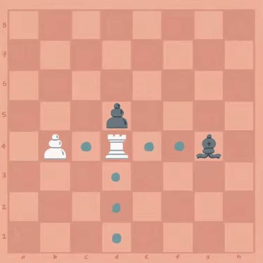

# Oppgave 7
> **Mål:** Implementere tårnets trekk

> **Hvor skal jeg jobbe:** [piece/rook.rs](piece/rook.rs)

I denne oppgaven skal vi implementere trekkene til tårnet. Du finner metodene som skal implementeres
`impl Piece for King {}`-blokken. Se etter metoden som inneholder en `todo!()`. I koden finner du også 
kommentarer som forklarer hva ulike metoder gjør.

Du finner også hint i [hint.md](hint.md).

## Tårnets trekk
Tårnet kan bevege seg så langt den vil mot nord, sør, øst og vest på brettet, helt til den når
enden av brettet eller en annen brikke. Tårnet kan bevege seg frem

1. *til og med* et felt som er tatt av en brikke med motsatt farge  
2. til *men ikke med* et felt som er tatt av en brikke med samme farge



> **PS! Rokade**  
> I likhet med kongen i oppgave 4 venter vi med å implementere rokade, som vanligvis også
omfatter tårnet (les mer om [rokade](https://snl.no/rokade_-_sjakk)).

## Eksempel
Et hvitt tårn befinner seg i startposisjon på `a1`, med en svart bonde på `a5` og en hvit løper på `c1`.
Tårnet skal kunne gå til `a2`, `a3`, `a4`, `a5` (hvor den slår svart bonde), og `b1`,
men ikke `c1` hvor hvit løper blokkerer:

```rust
let rook = Rook::new(Color::White, "a1".as_u8().unwrap());
let white_pieces = set!["c1"];
let black_pieces = set!["a5"];
let legal_moves = set!["a2", "a3", "a4", "a5", "b1"];
assert_eq_set!(legal_moves, rook.get_moves(&white_pieces, &black_pieces);
```

## Kjøring
```bash
cargo run 7
```
```bash
cargo test task_7
```

Se [hint.md](hint.md) for hint.