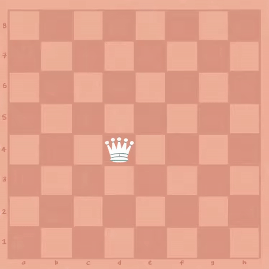

# Oppgave 9
> **Mål:** Implementere dronningens trekk

> **Hvor skal jeg jobbe:** [piece/queen.rs](piece/queen.rs)

I denne oppgaven skal vi implementere trekkene til dronningen. Du finner metodene som skal implementeres
`impl Piece for Queen {}`-blokken. Se etter metoden som inneholder en `todo!()`. I koden finner du også kommentarer
som forklarer hva ulike metoder gjør.

## Dronningens trekk
Dronningen kan bevege seg så mange trekk den vil i alle retninger, det vil si nord, vest, sør og
øst i tilegg til diagonalene. Den kan derimot ikke hoppe over brikker slik som springeren.



## Kjøring
```bash
cargo run 9
```
```bash
cargo test task_9
```

## Hint
Kan du gjenbruke noe av funksjonaliteten fra `Rook` og `Bishop` til å generere gyldige trekk for dronningen?

Se [hint.md](hint.md) for flere hint.